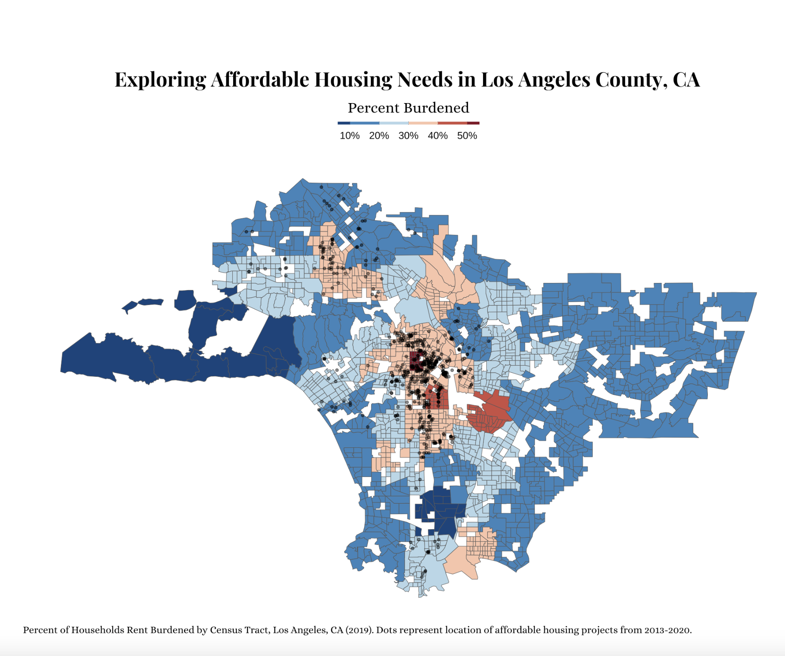
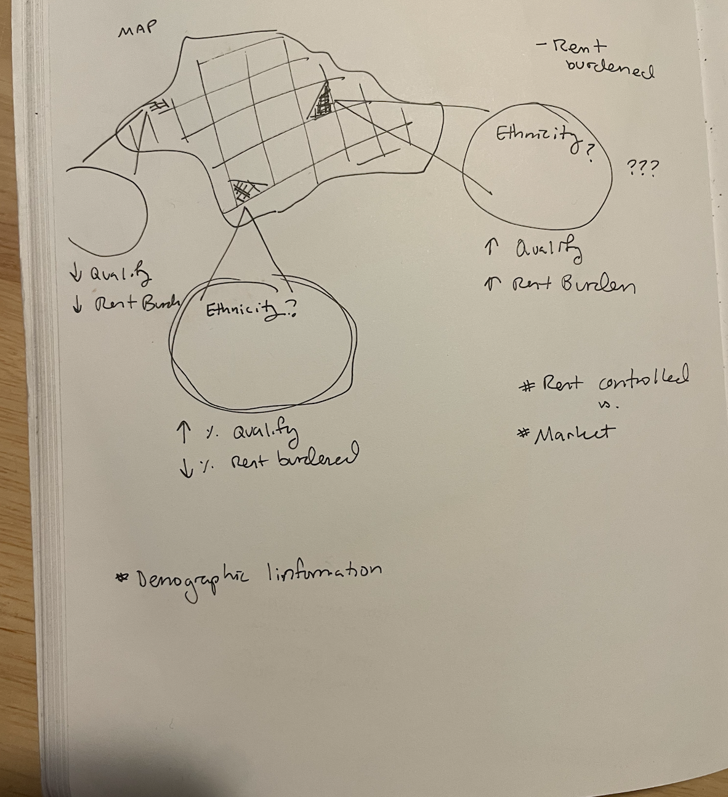

# Read in libraries

```{r include = FALSE}
library(tidyverse)
library(here)
library(lubridate)
library(janitor)
library(sf)
library(tidycensus)
library(patchwork)

# do google fonts
library(ggtext)

knitr::opts_chunk$set(message = FALSE, warning = FALSE)
```

# Questions

I plan to pursue the infographic option where I will be exploring affordable housing and housing needs in Los Angeles county. My initial thoughts are that the main image will be a map with the census tracts filled in with a variable. Possible variables include % of census tract by household that qualify for affordable housing, \# of households by tract that qualify for affordable housing, \# of individuals that qualify for affordable housing. Then, I want to zoom into specific tracts (eg. a tract with a high % of people that qualify for affordable housing and a tract with a low %) and compare the two by looking at vacancies in the tracts, affordable housing projects, or affordable housing units (though I haven't found this and it might be hard).\

My question has slightly changed to be more exploratory, however it could be used to explore how LA is doing at implementing the 2015 Executive Directive 13, Support for Affordable Housing (ED 13) aiming to help streamline the development of critical new housing developments that address our housing shortage. To really answer this question we would need a time series component. This could include looking at how the homelessness population in LA county has changed over time, as well as the number of affordable housing available (again, this data is really hard to come by which is why it was more interesting to look at vacancies as a proxy for available space that is maybe being kept off market even as the homeless population grows).\

Variables:\
- Number of vacancies in each tract from `tidycensus`\
- Total household income  (over the last 12 months) weighted also from `tidycensus`. For this one, based on the household size, and the cap to qualify for affordable housing I am going to assign a new variable that identifies whether that individual qualifies or not. I have a table from LAHD that has the income bins that decide whether households qualify or not.\
- Affordable housing developments dataset from [data.gov](https://catalog.data.gov/dataset/hcidla-affordable-housing-projects-list-2003-to-present) which I will wrangle and combine with homeless population data to see time series of number of affordable housing developments in LA county and homeless population over time.\
- Homeless population (over time? I don't have this data yet...only homeless counts from 2020)\

Viz Inspo:\

I really like [this](https://www.christophenicault.com/media/visualizations/bigmac_index.png) visualization because it has a map with different elements coming out of it. I want to do something with a map and have specific census tracts zoomed in on to show different trends and give more data. I like that it is easy to compare the graphs from the different counties that are highlighted and see trends.\

I also really like the format of information for [this](https://gradientdescending.com/survivor-confessionals-data-dataset-showcase-for-survivor/) image. The image is broken up into 3 columns, and the visualizations in each are described by the slight text box above it. 

Challenges:\
The challenges I am experiencing are how to add many informative graphics that will be added together to answer a questions. I think it would be really cool to do a time series where you can scroll and watch as the city changes and if there is a response by the building of affordable housing to those rent burden needs. \
\
I want to possibly to an interactive element with `plotly` but honestly haven't had the time to really explore a bunch of different packages. The viz I tagged above do need other packages, and I will probably end up using those. But as of right now uncertain!

FEEDBACK:\
- What elements to focus on for the final plot? Ways to zoom in and compare across different areas. Would love to chat about this in person.\
- Would a time series of this be helpful? I'm thinking looking from the time the Executive order in 2015 was made, how it has changed rent burdened communities. Now that I have the workflow I think I would be more easily able to access information from multiple years.\
- Do I include multiple maps? Maybe some literature.\
- Im excited!!!


```{r message = FALSE}


```

# Data

## Wrangle and Clean Data
 https://www.census.gov/cgi-bin/geo/shapefiles/index.php 

```{r message = FALSE, warning = FALSE, results='hide'}
# geometry of the puma shapefiles
puma <- read_sf(here("data", "tl_2022_06_puma20", "tl_2022_06_puma20.shp"))

puma_la <- puma %>% 
  filter(grepl(037, PUMACE20)) %>% 
  rename(PUMA = PUMACE20)

# # this is what I was using before 
# pums_housing_income_2019 <- get_pums(state = "06",
#                               survey = "acs1",
#                               variables = c("PUMA",
#                                             "NP", #	Number of persons in this household
#                                             "HINCP", # Household income (past 12 months, use ADJINC to adjust HINCP to constant dollars
#                                             "GRPIP", #Gross rent as a percentage of household income past 12 months")
#                                             "FINCP" # Family income (past 12 months, use ADJINC to adjust FINCP to constant dollars)
#                                             ),
#                               year = 2019)

# updating to newest PUMS data
pums_housing_income <- get_pums(state = "06",
                              survey = "acs1",
                              variables = c("PUMA",
                                            "NP", #	Number of persons in this household
                                            "HINCP", # Household income (past 12 months, use ADJINC to adjust HINCP to constant dollars
                                            "GRPIP", #Gross rent as a percentage of household income past 12 months")
                                            "FINCP" # Family income (past 12 months, use ADJINC to adjust FINCP to constant dollars)
                                            ),
                              year = 2022)

# https://www.huduser.gov/portal/datasets/il/il2020/2020summary.odn
people <- c(1, 2, 3, 4, 5, 6, 7, 8)
very_low <- c(39450, 45050, 50700, 56300, 60850, 65350, 69850, 74350)
extreme_low <- c(23700, 27050, 30450, 33800, 36550, 39250, 41950, 44650)
low <- c(63100, 72100, 81100, 90100, 97350, 104550, 111750, 118950)

income_breaks <- data.frame(people, extreme_low, very_low, low)

# remove the duplicates 
puma_house_codes <- pums_housing_income %>% 
  select(SERIALNO, PUMA) %>% 
  distinct()

puma_h <- pums_housing_income %>% 
  inner_join(puma_la, by = "PUMA") %>% 
  select(SERIALNO, WGTP, NP, HINCP, FINCP, GRPIP) %>% 
  mutate(NP = as.numeric(NP),
         HINCP = as.numeric(HINCP),
         FINCP = as.numeric(FINCP),
         GRPIP = as.numeric(GRPIP)) %>% 
  group_by(SERIALNO) %>% 
  summarize_all(mean, na.rm = TRUE) %>% 
  left_join(puma_house_codes)

la_tract_vacant <- get_acs(
  state = "CA",
  county = "Los Angeles",
  geography = "tract",
  variables = "B25004_001",
  geometry = TRUE,
  year = 2022
)

la_tract <- la_tract_vacant %>%
  mutate(NAME = gsub("; Los Angeles County; California", # elements that you want to remove
                                  "", # replace with blank
                                  NAME)) %>%
  mutate(NAME = gsub("Census Tract ", # elements that you want to remove
                                  "", # replace with blank
                                  NAME)) %>% 
  filter(GEOID != "06037599100") %>% # islands
  filter(GEOID != "06037599000") %>% # islands
  filter(GEOID != "06037980003") %>%
  filter(GEOID != "06037980004") %>%
  filter(!(NAME >= 9000 & NAME <= 9800))


plot(la_tract$geometry)
  
```

# Assigning income categories to households 

## Create income breaks for households above 8 (from 9-20)
```{r message = FALSE}
# very low income 
size <- seq(9, 20, 1)
very_low <- data.frame()
row_n <- data.frame()

for (i in seq_along(size)) {
  income <- 1.32 + (i*.08)
  limit <- income*56300
  row <- size[i]
  row_n <- rbind(row_n, row)
  very_low = rbind(very_low, limit)
}

very_low <- cbind(row_n, very_low) %>% 
  rename(people = X9,
         very_low = X78820)

extreme <- data.frame()
for (i in seq_along(size)) {
  # https://www.huduser.gov/portal/datasets/il/il2020/2020ILCalc3080.odn#calculator
  income <- 44120 + (i*4480)
  extreme <- rbind(extreme, income)
}

low <- data.frame()
for (i in seq_along(size)) {
  income <- 1.32 + (i*.08)
  limit <- income*90100
  low <- rbind(low, limit)
}

cols_9_20 <- cbind(extreme, very_low) %>% 
  rename(extreme_low = X48600) %>% 
  cbind(low) %>% 
  rename(low = X126140)

income_breaks <- rbind(income_breaks, cols_9_20)
```


## Creating For Loop

### Testing for loop on subset of dataset
```{r, eval = FALSE}
df_test <- slice_tail(puma_h, n = 10)
df_test$status <- rep(NA, nrow(df_test))

for (person in 1:nrow(df_test)) {
  
  individual <- df_test$NP[person]
  
  income <- income_breaks %>% 
    filter(people == individual)
  
  #print(individual)
  # Define thresholds for labels
  extreme_threshold <- income[[2]]
  very_low_threshold <- income[[3]]
  low_threshold <- income[[4]]
  
  print(extreme_threshold)
  # # Assign labels based on thresholds
  df_test$status[person] <- ifelse(df_test[["HINCP"]][person] <= extreme_threshold, 
                  "extreme",
                  ifelse(df_test[["HINCP"]][person] <= very_low_threshold & df_test[["HINCP"]][person] > extreme_threshold,
                         "very low",
                         ifelse(df_test[["HINCP"]][person] <= low_threshold & df_test[["HINCP"]][person] > very_low_threshold, "low", 
                                "not eligible")))
}
```

### Applying for loop to the whole data set

```{r message = FALSE}
puma_h$status <- rep(NA, nrow(puma_h))

for (person in 1:nrow(puma_h)) {
  
  individual <- puma_h$NP[person]
  
  income <- income_breaks %>% 
    filter(people == individual)
  
  #print(individual)
  #print(individual)
  # Define thresholds for labels
  extreme_threshold <- income[[2]]
  very_low_threshold <- income[[3]]
  low_threshold <- income[[4]]
  
  # # Assign labels based on thresholds
  puma_h$status[person] <- ifelse(puma_h[["HINCP"]][person] <= extreme_threshold, 
                              "extreme",
                              ifelse(puma_h[["HINCP"]][person] > extreme_threshold & puma_h[["HINCP"]][person] <= very_low_threshold, 
                                     "very low",
                                     ifelse(puma_h[["HINCP"]][person] > very_low_threshold & puma_h[["HINCP"]][person] <= low_threshold, 
                                            "low",
                                            ifelse(puma_h[["HINCP"]][person] > low_threshold, "not eligible", "non"))))
}

```


```{r message = FALSE}
puma_geo <- puma_la %>% 
  select(PUMA, geometry)

plot(puma_geo$geometry)

puma_plot <- puma_h %>% 
  group_by(PUMA) %>% 
  count(status) %>% 
  pivot_wider(names_from = "status", values_from = "n") %>% 
  ungroup() %>% 
  clean_names() %>% 
  select(puma, extreme, very_low, low, not_eligible) %>% 
  mutate(PUMA = puma, 
         total_households = rowSums(.[2:5]),
         total_eligible = rowSums(.[2:4]),
         percent_eligible = (total_eligible/total_households) * 100 ) %>% 
  left_join(puma_geo) %>% 
  st_as_sf()

puma_plot_crop <- st_crop(puma_plot, la_tract)

plot(puma_plot_crop$geometry)
```


## Suggestions 
- Public Use Microdata Sample 
- Get rid of catalina island 
- get rid of everything above households 
- cut block off where city makes the ocean 
- in 2019
- follow up comparisons 
  - circle regions on each side of the spectrum and compare 
  - red yellow blue 

```{r, eval = FALSE, include = TRUE, fig.width = 11, fig.height = 14}

title <- "Households Eligible for Affordable Housing by PUMA in Los Angeles, CA"
subtitle <- str_wrap(
  "Percent of people that qualify for affordabl housing", 180)


my_brew_palette10 <- RColorBrewer::brewer.pal(n = 10, name = 'RdBu')


ggplot(puma_plot_crop) +
  geom_sf(aes(fill = percent_eligible)) +
  scale_fill_stepsn(colors = rev(my_brew_palette10),
                    labels = scales::label_percent(scale = 1),
                    breaks = scales::breaks_width(width = 10)) +
  theme_minimal() +
  labs(title = "Households Eligible for Affordable Housing by PUMA in Los Angeles, CA",
       fill = "Percent Eligible") +
  theme(
    axis.text = element_blank(),
    panel.grid.minor = element_blank(),
    panel.grid.major = element_blank(),
    plot.margin = margin(12, 6, 12, 18),
    panel.background = element_rect(fill = "white", colour = NA),
    title = element_text(hjust = )
  ) +
  guides(fill = guide_colorbar(barheight = unit(1, units = "mm"),  
                                 barwidth = unit(100, units = "mm"),
                                 direction = "horizontal",
                                 ticks.colour = "grey20",
                                 title.position = "top",
                                 label.position = "bottom",
                                 title.hjust = 0.5))

```

```{r, message=FALSE}
# homeless counts 2020
homeless_counts <- read_csv(here("data", "Homeless_Counts_2020.csv")) %>% 
  mutate(CSA_Label = gsub("City of ", # elements that you want to remove
                                  "", # replace with blank
                                  CSA_Label)) %>% 
  mutate(CSA_Label = gsub("Los Angeles - ", # elements that you want to remove
                                  "", # replace with blank
                                  CSA_Label))
# has 2196 points
tract_neighborhood <- read_csv(here("data/Census_Tract_Locations__LA__20240206.csv")) %>% 
  mutate(census_tract = gsub(", Los Angeles County, California", # elements that you want to remove
                                  "", # replace with blank
                                  Tract)) %>% 
  select(-Tract, census_tract, Neighborhood, Latitude, Longitude) %>% 
  st_as_sf(coords = c("Longitude", "Latitude"), # make into geometry object
                 crs = st_crs(puma_plot)) %>% 
  st_crop(puma_plot_crop) # neighborhoods only in the census tracts of interest

# make a df with the puma information and census tract geometry 
puma_tract <- puma_plot_crop %>% # has 67 observations
  st_join(tract_neighborhood,
                join = st_intersects) %>% # has the same number of points as the neighborhood
  clean_names() %>% 
  select(neighborhood, census_tract, location, puma, geometry) %>% 
  mutate(census_tract = gsub("Census Tract ", # elements that you want to remove
                                  "", # replace with blank
                                  census_tract))

# rename the tract column
la_tract <- la_tract %>% 
  rename(census_tract = NAME) %>% 
  select(census_tract, geometry)

puma_tract <- puma_tract %>% 
  st_drop_geometry() %>% 
  #select(neighborhood, census_tract, location, puma) %>% 
  left_join(la_tract)


plot(puma_tract$geometry)

puma_eligibility <- puma_plot %>% 
  st_drop_geometry() %>% 
  select(!PUMA)

tract_eligibility <- puma_tract %>% 
  left_join(puma_eligibility, by = "puma") %>% 
  filter(!st_is_empty(geometry)) %>% 
  st_as_sf()

# puma_eligibility <- puma_plot %>% 
#   select(!PUMA)
# 
# tract_eligibility <- puma_tract %>% 
#   st_as_sf() %>% 
#   st_join(puma_eligibility,
#             join = st_intersects) %>% 
#   filter(!st_is_empty(geometry))
```

# Creating a custom theme
```{r}
library(monochromeR)
library(showtext)
library(ggtext)
library(ggrepel)

# import google fonts 
font_add_google(name = "Josefin Sans",
                family = "josefin") # name we provide ggplot

font_add_google(name = "Sen",
                family = "sen") # name we provide ggplot

font_add_google(name = "Tenor Sans",
                family = "tenorSans") # name we provide ggplot

# Pairs
font_add_google(name = "Playfair Display",
                family = "playfairDisplay") # name we provide ggplot

font_add_google(name = "Alice",
                family = "alice") # name we provide ggplot

# enable show text here that configures font across platforms
showtext_auto()

my_theme <- theme(
  plot.title = element_text(size = 20, face = "bold", family = "playfairDisplay", hjust = 0.5), # Font size set to 16 and bold.
  plot.caption.position = "plot",
  plot.caption = element_text(size = 10, hjust = 0, family = "alice"),
  axis.title = element_text(size = 14), # Font size set to 12.
  axis.text = element_blank(), # no axis text.
  axis.ticks = element_blank(),
  legend.title = element_text(size = 15, face = "bold", family = "alice"), # Font size of the title of the legend set to 12 and bold.
  legend.text = element_text(size = 10), # font size of the text in the legend
  panel.background = element_rect(fill = "white"), # color of the panel background
  panel.grid.major = element_blank(),
  plot.margin = margin(12, 6, 12, 18),
  panel.grid.minor = element_blank(), # invisible auxiliary grids
  plot.background = element_rect(fill = "white"), # plot's background
  strip.background = element_rect(fill = "white", color = "#ff975d"), # strip background
  strip.text = element_text(size = 12, face = "bold", family = "alice"), # strip texts
  plot.title.position = "plot", #position of the plot title
  legend.position = "top", # position of the legend
  legend.box.background = element_rect(color = "white"), # background of the plot
  legend.key.size = unit(1, "cm") # size of the legends key
)
```


```{r fig.width = 11, fig.height = 11}
my_brew_palette10 <- RColorBrewer::brewer.pal(n = 10, name = 'RdBu')

tract_eligibility_percent <- ggplot(tract_eligibility) +
  geom_sf(aes(fill = percent_eligible)) +
  scale_fill_stepsn(colors = rev(my_brew_palette10),
                    labels = scales::label_percent(scale = 1),
                    breaks = scales::breaks_width(width = 10)) +
  labs(title = "Exploring Affordable Housing Needs in Los Angeles County, CA",
       fill = "Percent Eligible",
       caption = "Households Eligible for Affordable Housing by PUMA in Los Angeles, CA") + 
  guides(fill = guide_colorbar(barheight = unit(1, units = "mm"),  
                                 barwidth = unit(100, units = "mm"),
                                 direction = "horizontal",
                                 ticks.colour = "grey20",
                                 title.position = "top",
                                 label.position = "bottom",
                                 title.hjust = 0.5)) +
  my_theme 

tract_eligibility_percent
#plot(puma_plot$geometry)
```

# Most and Least Eligible Census / Neighborhood by percent eligibility for affordable housing 

```{r eval = FALSE, include = TRUE}

top_eligible <- tract_eligibility %>% 
  slice_max(order_by = percent_eligible,
            n = 10)

bottom_eligible <- tract_eligibility %>% 
  slice_min(order_by = percent_eligible,
            n = 10)

# plot(top_eligible$geometry)
# plot(bottom_eligible$geometry)
```

# Adding the homeless count data 

```{r eval = FALSE, include = TRUE}

homeless_tract <- tract_eligibility %>% 
  left_join(homeless_counts %>% 
              rename(neighborhood = CSA_Label) %>% 
              mutate(neighborhood == case_when(neighborhood == "Unincorporated - West Chatsworth" ~ "Chatsworth Reservoir"),
                     .default = as.character(neighborhood)))

my_brew_palette20 <- RColorBrewer::brewer.pal(n = 10, name = 'Greens')


ggplot(homeless_tract) +
  geom_sf(aes(fill = Total_Unsheltered_Pop)) +
  scale_fill_stepsn(colors = my_brew_palette20,
                    breaks = scales::breaks_width(width = 300)) +
  theme_minimal() +
  labs(title = "Homeless Counts by Census Tract in Los Angeles, CA",
       fill = "Person Counts") +
  theme(
    axis.text = element_blank(),
    panel.grid.minor = element_blank(),
    panel.grid.major = element_blank(),
    plot.margin = margin(12, 6, 12, 18),
    panel.background = element_rect(fill = "white", colour = NA),
    title = element_text(hjust = )
  ) +
  guides(fill = guide_colorbar(barheight = unit(50, units = "mm"),  
                                 barwidth = unit(1, units = "mm"),
                                 direction = "vertical",
                                 ticks.colour = "grey20",
                                 title.position = "right",
                                 label.position = "left",
                                 title.hjust = 0.5))
```
# Looking at the places where affordable housing projects started

```{r, message=FALSE}
# read in affordable housing projects in LA from 2003 to present
ah_raw <- read_csv(here("data/LAHD_Affordable_Housing_Projects_List__2003_to_Present__20240119.csv")) %>% 
  clean_names()

# clean affordable housing data 
ah_clean <- ah_raw %>% 
  mutate(fun_date = as.Date(date_funded, tryFormats = c("%m/%d/%Y"))) %>% # make date_funded as date
  mutate(year = lubridate::year(fun_date)) %>% # make into year column 
  select(name, year, fun_date, construction_type, site_community, total_units = project_total_units, 
         housing_type, lahd_funded, in_service_date, gps_coords_on_map) %>% 
  mutate(gps_coords_on_map = gsub("[POINT()]", # elements that you want to remove
                                  "", # replace with blank
                                  gps_coords_on_map)) %>% # remove these elements from gps column 
  separate_wider_delim(gps_coords_on_map, 
                       delim = " ", names = c("empty", "coords"), # separate space from before the coordinates
                       too_many = "merge") %>% 
  separate_wider_delim(coords, delim = " ", names = c("Longitude", "Latitude"), # split lat and long coords
                       too_many = "merge") %>% 
  select(-empty) %>% 
  st_as_sf(coords = c("Longitude", "Latitude"), # make into geometry object
                 crs = st_crs(la_tract)) %>% 
  st_join(la_tract) %>% 
  mutate(site_community = str_to_title(site_community))

v17 <- load_variables(2022, "acs5", cache = TRUE)

census_geom <- tract_eligibility %>% 
  select(census_tract, geometry)

total_vacant <- la_tract_vacant %>% 
  mutate(NAME = gsub(", Los Angeles County, California", # elements that you want to remove
                                  "", # replace with blank
                                  NAME)) %>% 
  mutate(NAME = gsub("Census Tract ", # elements that you want to remove
                                  "", # replace with blank
                                  NAME)) %>% 
  rename(total_vacant = estimate,
         census_tract = NAME) %>% 
  st_drop_geometry() %>% 
  left_join(census_geom) %>% 
  st_as_sf()

```

# Plotting affordable housing projects made since 2003

```{r eval = FALSE, include=TRUE}
ggplot(la_tract) +
  geom_sf() +
  geom_sf(data = ah_clean, alpha = 0.5, size = 1, aes(color = year))

ggplot(total_vacant) +
  geom_sf(aes(fill = total_vacant)) +
  scale_fill_stepsn(colors = my_brew_palette20,
                    breaks = scales::breaks_width(width = 500))
```

# Looking at census tract and the percent of income spent on rent: Rent Burdened

```{r}

rent_burden <- puma_h %>% 
  group_by(PUMA) %>% 
  rename(percent_rent = GRPIP) %>% 
  select(WGTP, percent_rent, PUMA) %>% 
  mutate(status = ifelse(percent_rent >= 30, "burden", "not_burden")) %>% 
  count(status) %>% 
  pivot_wider(names_from = "status", values_from = "n") %>% 
  ungroup() %>% 
  rename(puma = PUMA) %>% 
  mutate(total = burden+not_burden,
         percent_burden = (burden/total)*100)
  
#plot(rent_burden_2$geometry)

rent_burdened <- puma_tract %>% 
  left_join(rent_burden) %>% 
  filter(!st_is_empty(geometry)) %>% 
  st_as_sf()
```


```{r fig.width = 11, fig.height = 11}
my_brew_palette15 <- RColorBrewer::brewer.pal(n = 20, name = 'YlGnBu')

rent_burden_plot <- ggplot(rent_burdened) +
  geom_sf(aes(fill = percent_burden)) +
  scale_fill_stepsn(colors = rev(my_brew_palette10),
                    breaks = scales::breaks_width(width = 10),
                    labels = scales::label_percent(scale = 1)) +
  labs(title = "Exploring Affordable Housing Needs in Los Angeles County, CA",
       fill = "Percent Burdened",
       caption = "Percent of Households Rent Burdened by Census Tract, Los Angeles, CA (2019). Dots represent location of affordable housing projects from 2013-2020.") +
  guides(fill = guide_colorbar(barheight = unit(1, units = "mm"),  
                                 barwidth = unit(50, units = "mm"),
                                 direction = "horizontal",
                                 ticks.colour = "grey20",
                                 title.position = "top",
                                 label.position = "bottom",
                                 title.hjust = 0.5)) +
  my_theme

burden_affordable_projects <- rent_burden_plot +
  geom_sf(data = ah_clean, alpha = 0.5, size = 1)

burden_affordable_projects
```

